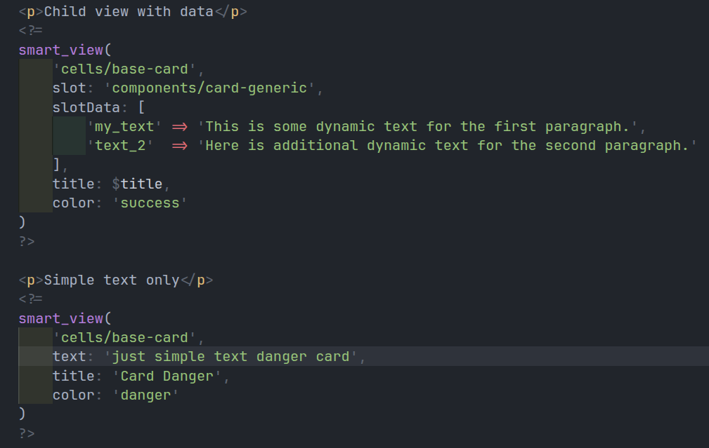

# php-caddy-ci4_6_4


## env setup

in _config exists:

- dockerfile.php: php custom imagem prepared for php  + codeigniter 4

- Caddyfile: configuration of caddy server ( using **8026** port to access via browser)

- docker-compose.yml: config with server + php 


## Goals

- config caddy port for another port other than 80 (localhost)

- now calling localhost:8026

- setup codeigniter 4 

- simple example of using codeigniter view cell ( as component)

- create master / base page

- changed / custom  local of routes config to: `app > Routes > index.php`

- defined some cli command in `composer.json` to generate ci `controllers`, `models` and `filters`

## New 31/01/2026

- added a custom helper called `smart_view` to render views with dynamic slots

- add a example view to show how to use dynamic slots in views

- add a example in view without data on slot

- add a example in view with data on slot and slotData



## 24/01/2026

-  change Routes > `index` >> Routes > `web`

- Change Config > routes, removed default namespace and class

- Change Config > routes, change default method to `__invoke`

- previous two change:

    - allow call controller as single action
    - prevent use only simple string to define controll + method
    - similar to laravel, only as to indicate the controller:

         ```[MyClass:class, 'method']```
         
         `MyClass::class` (single action)

- Shows beter ways to use Cell views with `dynamic` body

## image

pages


custom scripts in `composer.json`:


