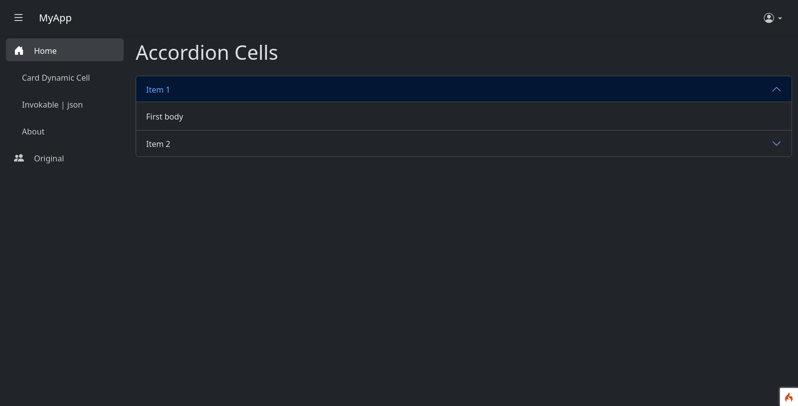
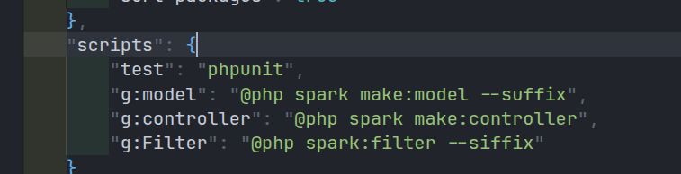

# php-caddy-ci4_6_4

## env setup

in _config exists:

- dockerfile.php: php custom imagem prepared for php  + codeigniter 4

- Caddyfile: configuration of caddy server ( using **8026** port to access via browser)

- docker-compose.yml: config with server + php 

## Goals

- config caddy port for another port other than 80 (localhost)

- now calling localhost:8026

- setup codeigniter 4 

- simple example of using codeigniter view cell ( as component)

- create master / base page

- changed / custom  local of routes config to: `app > Routes > index.php`

- defined some cli command in `composer.json` to generate ci `controllers`, `models` and `filters`

## image

pages

custom scripts in `composer.json`:

